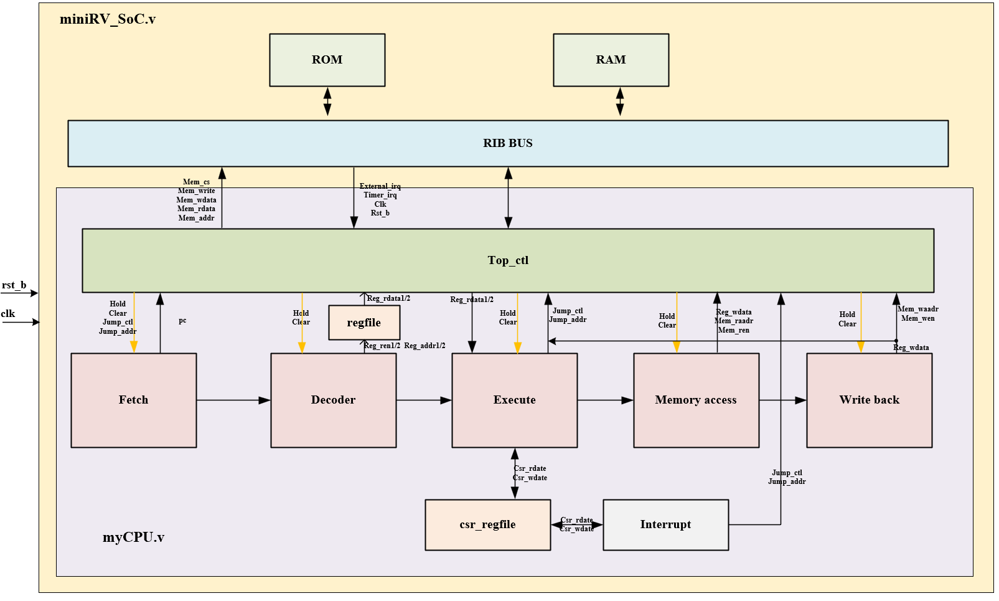
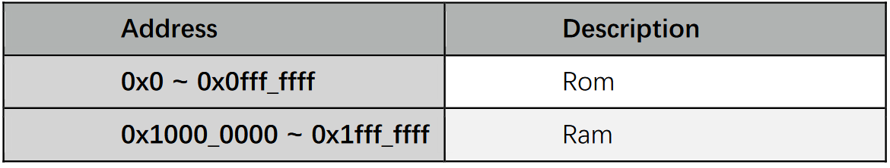

# 1.介绍

本项目实现的是一个单核32位的小型RISC-V处理器核，采用verilog语言编写。
本项目有以下特点：

1. 支持RV32I指令集，通过RISC-V指令兼容性测试；
2. 采用五级流水线，即取指，译码，执行，访存，回写；
3. 支持中断；
4. 支持总线；

项目中的各目录说明：

**src**：该目录有三部分，其中mycpu为cpu所有verilog源码，soc包含组成soc的verilog源码，tb包含仿真的testbench文件；

**sim**：该目录包含仿真批处理zsh文件以及包含测试程序源码，其中riscv_tests，测试 riscv 指令集，riscv_compliance ， 测 试 riscv 指 令 集 和 架 构 规 范；

**pic**：存放图片；

**fpga**：存放FPGA相关文件，比如约束文件；

cpu的整体框架如下：



cpu目前外挂了2个外设，每个外设的空间大小为16KB，地址空间分配如下图所示：



# 2.如何使用

本项目可以运行在Windows和Linux平台，编译仿真工具使用的是iverilog和vpp，波形查看工具使用的是gtkwave。

## 2.1Windows平台环境搭建

必须安装的工具：

1. 安装iverilog工具
2. 安装GNU工具链
3. 安装make工具
4. 安装python3
5. 安装zsh


## 2.2Linux平台环境搭建

这里以Ubuntu系统为例进行说明。

1. 下载iverilog

2. 安装依赖

`sudo apt-get install autoconf gperf flex bison build-essential zsh`

4. 编译、安装iverilog和vvp

```
sh autoconf.sh
./configure
make
make install
```

5. 创建python软链接

`sudo ln -s /usr/bin/python3.8 /usr/bin/python`

其中/usr/bin/python3.8对应你实际安装的python版本。

6. 安装gtkwave

`sudo apt-get install gtkwave`

7. 安装GNU工具链
   
`sudo apt-get install gcc-riscv64-unknown-elf`


## 2.3运行指令测试程序

这里以Linux平台为例进行说明，Windows平台是类似的。

### 2.3.1 运行旧的指令测试程序

旧的指令测试程序属于比较早的指令兼容性测试方法，虽然目前RISC-V官方已经不更新了，但仍然是一个比较好的测试参考。

在sim目录下：
重跑所有 riscv_tests pattern: zsh 环境下在 sim ⽬录下运⾏ run_all_riscv_tests.zsh

`./sim: zsh run_all_riscv_tests.zsh`


### 2.3.2运行新的指令测试程序

新的指令兼容性([riscv-compliance](https://github.com/riscv/riscv-compliance))测试项相对于旧的指令兼容性测试项来说对指令的测试更加严谨，可以精确到每一条指令的运行结果，而且RISC-V官方一直在更新。


在sim目录下：
重跑所有 riscv_tests pattern: zsh 环境下在 sim ⽬录下运⾏ run_all_riscv_tests.zsh

`./sim: run_all_riscv_compliance.zsh`


# 3.移植到FPGA

详细的移植方法请查看本项目下的fpga目录中的README.md文件。
